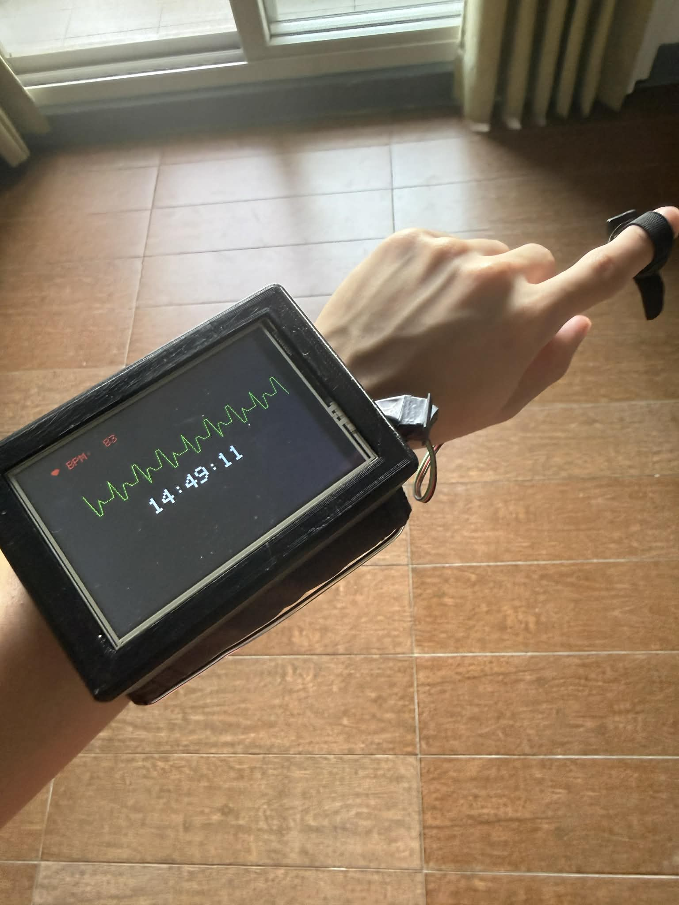
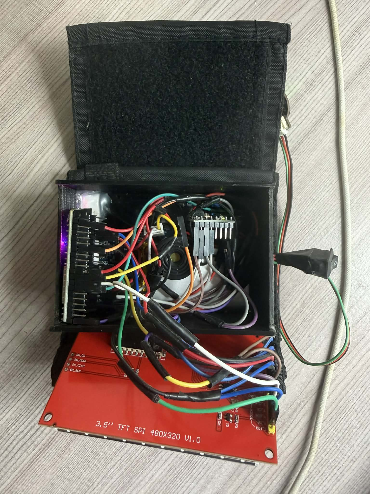

# Hi, I'm Hilaire Hughie Dy (李浚成) 👋
**Computer Engineering & AI Student @ NCUT | IoT Developer | Mechanical Fabricator**

A hands-on engineer bridging the gap between heavy mechanical fabrication and intelligent embedded systems. Currently specializing in Computer Engineering and Artificial Intelligence in Taichung, Taiwan.

---

## 🏎️ Project: Multi-Phase ATV-Kart Engineering
> **From Rigid Prototype to Suspended All-Terrain Vehicle**

### ⚙️ v2.0 Upgrades: Terrain & Suspension
* **Suspension Geometry:** Re-engineered the rigid frame to integrate **motorcycle shock absorbers**; calculated mounting angles to support dynamic passenger loads and improve stability on uneven surfaces.
* **Terrain Adaptability:** Upgraded to large-diameter **ATV wheels**, significantly increasing ground clearance and enabling off-road functionality.
* **Thermodynamics Analysis:** Analyzed the efficiency of the **Honda GX200 4-Stroke Engine** by applying the First and Second Laws of Thermodynamics:
    $$|Q_H| = |W| + |Q_L|$$
    *Evaluated thermal output vs. mechanical work for engineering performance tasks.*

### 🛠️ Core Engineering & Fabrication
* **Structural v1.0 (Rigid Chassis):** Fabricated an initial low-profile frame using **square steel tubing**; utilized precision cutting with a Circular Chop Saw and Angle Grinder for core assembly.
* **MIG Welding:** Executed high-strength structural welds on all load-bearing joints, motor mounts, and steering knuckles to ensure frame rigidity.
* **Industrial Restoration:** Salvaged components from **Kart Zone Cebu** using a 3-stage restoration process (Mechanical de-rusting, Catalyst treatment, and Industrial anti-corrosion finish).

### 🎨 Digital Fabrication & Design
* **Custom Digitized Upholstery:** Produced a custom leather seat by encoding graphical designs into industrial software for execution on a **Tajima Industrial Embroidery Machine**.
* **Control Systems:** Integrated a hydraulic disc brake system and a manual throttle/pedal assembly for responsive handling.

---

## ⌚ Project: AetherPulse — IoT Health & Fall Detection
> **Full-Stack IoT: Biometric Monitoring, Redundant Alerting, & Hardware Prototyping**

  
  

* 📜 **View Source Code:** [SmartWatch_Code.ino](./SmartWatch_Code.ino)
### 🚀 Key Features
* **Biometric Pulse Monitoring:** Real-time **Heart Rate (BPM)** sensing with a custom-coded graphical pulse-wave visualizer on a 3.5" TFT display.
* **Fall Detection Logic:** Engineered a threshold-based algorithm using the **MPU6050 Accelerometer** to trigger multi-channel emergency alerts (Blynk Push + Automated Email).
* **IoT Cloud Integration:** Leveraged the **Blynk IoT Platform** for remote data logging and **RTC synchronization** for precision event timestamping.
* **Hardware Design:** Designed a form-fitting wearable case using CAD and fabricated it via **FDM 3D Printing** for component security and durability.

---

## 📊 Professional Experience
**Knowles (Cebu, Philippines) — Technical Work Immersion**

* **Process Monitoring:** Utilized **Microsoft Excel** to track high-precision production metrics and identify operational anomalies.
* **Root Cause Analysis:** Analyzed technical errors and designed strategy presentations in **PowerPoint** for senior management to optimize factory workflow.
* **Factory Vigilance:** Operated within high-precision industrial environments adhering to strict SOPs and safety protocols.

---

## 🛠 Technical Skills
* **Embedded Systems:** ESP32/Arduino, C++, I2C/SPI Protocols, Li-Ion Power Management.
* **Fabrication:** MIG Welding, Metal Restoration, **FDM 3D Printing**, IC Engine Tuning.
* **Industrial Software:** Tajima Pulse (Embroidery Encoding), CAD Modeling, Microsoft Excel (Analytics).
* **Languages:** English (905 TOEIC), Tagalog, Mandarin (Conversational).

---

## 📫 Connect with Me
* 💼 **LinkedIn:** [linkedin.com/in/hilaire-hughie-dy](https://linkedin.com/in/hilaire-hughie-dy-499894346)
* 📧 **Email:** [hilairedy22@gmail.com](mailto:hilairedy22@gmail.com)
* 📍 **Location:** Taichung, Taiwan
